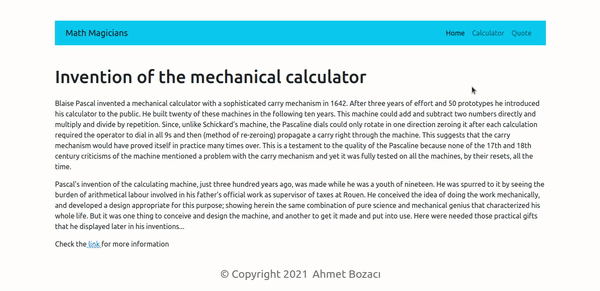

# Math Magicians
> Math magicians is a website for all fans of mathematics. It is a Single Page App (SPA) that allows users to make simple calculations and read a random math-related quote.




## Built With
- Html
- Javascript
- React
- JSX
- CSS
- Reactstrap
- Bootstrap

## Live Demo

- [Math Magicians-Netlify](https://math-magicians-react.netlify.app/)

## Setup
- Clone this project
```
- $ git clone `$ https://github.com/ahmetbozaci/math_magicians.git`
- $ cd math_magicians
```
- Install npm packages
```
- $ npm install
```
- Open website
```
- $ npm start
```

## Authors

👤 **Ahmet Bozacı**
- Github:[ahmtbozaci](https://github.com/ahmetbozaci)
- Twitter:[ahmtbozaci](https://twitter.com/ahmtbozaci)
- LinkedIn:[Ahmet Bozaci](https://www.linkedin.com/in/ahmetbozaci/)

## 🤝 Contributing

Contributions, issues, and feature requests are welcome!

Feel free to check the [issues page](../../issues/).

## Show your support

Give a ⭐️ if you like this project!

## 📝 License

This project is [MIT](./LICENCE) licensed.
